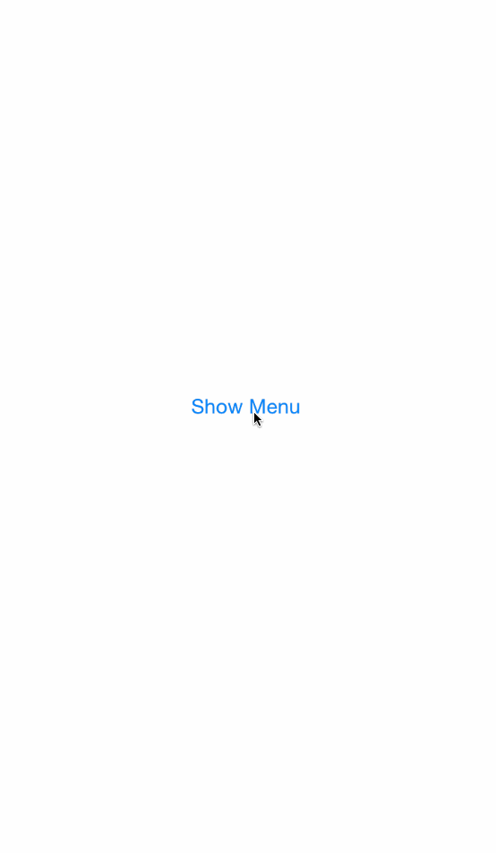

# DWNavMenu
A highly customizable UIActionSheet style menu with simple navigation and block handling



This class is a simple navigation menu in the style of a UIActionSheet. This class makes it easy to create seamless menu funnels using block handling and simple navigation. Includes all the features of a UIActionSheet, and all navigation handling is done internally. Also supports landscape and portrait orientation changes. All button sizes, fonts, colors, spacing, and et cetera is all customizable and can be found in the DWNavMenu header file.

Note you only need to import the DWNavMenu header file, but you'll need all the source files included in your project.

CocoaPods
==================
```
Coming soon
```

Usage
==================
You create a menu by calling the class or instance method initializer. You can add buttons with the DWNavMenuAction class. This class has only one initializer where you can include the button title, if it will dismiss the menu or not, and the block to invoke when it's tapped.

Here is an example of creating a DWNavMenu instance:
```objective-c
        DWNavMenu *someMenu = [DWNavMenu navMenuWithTitle:@"Sample Menu"
                                        cancelButtonTitle:nil
                                             cancelAction:nil
                                                  buttons:
                               [DWNavMenuAction menuActionWithTitle:@"This is a button"
                                                  shouldDismissMenu:YES
                                                       blockHandler:^{
                                                           NSLog(@"This button was tapped");
                                                       }], nil];
```

If you wanted to push the last NavMenu onto another NavMenu's navigation stack, you would do it like so:
```objective-c
        self.mainMenu = [DWNavMenu navMenuWithTitle:@"Main Menu"
                                  cancelButtonTitle:@"Cancel"
                                       cancelAction:nil
                                            buttons:
                         [DWNavMenuAction menuActionWithTitle:@"Show sample sub-menu?"
                                            shouldDismissMenu:NO
                                                 blockHandler:^{
                                                     NSLog(@"Tapped show sample sub-menu");
                                                     [self.mainMenu pushNavMenu:someMenu animated:YES];
                                                 }], nil
                         ];
```

You can also add a destructive style button, for instance if you wanted to show a delete or remove button with visual warning separate from other buttons.
```objective-c
    self.mainMenu.destructiveMenuAction = [DWNavMenuAction menuActionWithTitle:@"Delete"
                                                             shouldDismissMenu:YES
                                                                  blockHandler:^{
                                                                      NSLog(@"Delete button was tapped");
                                                                  }];
```
